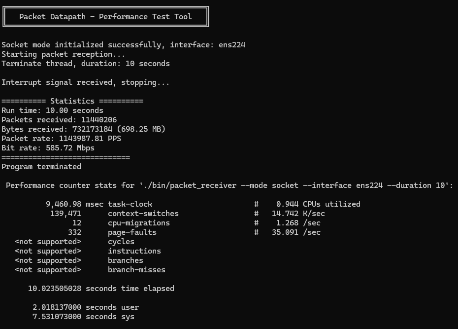
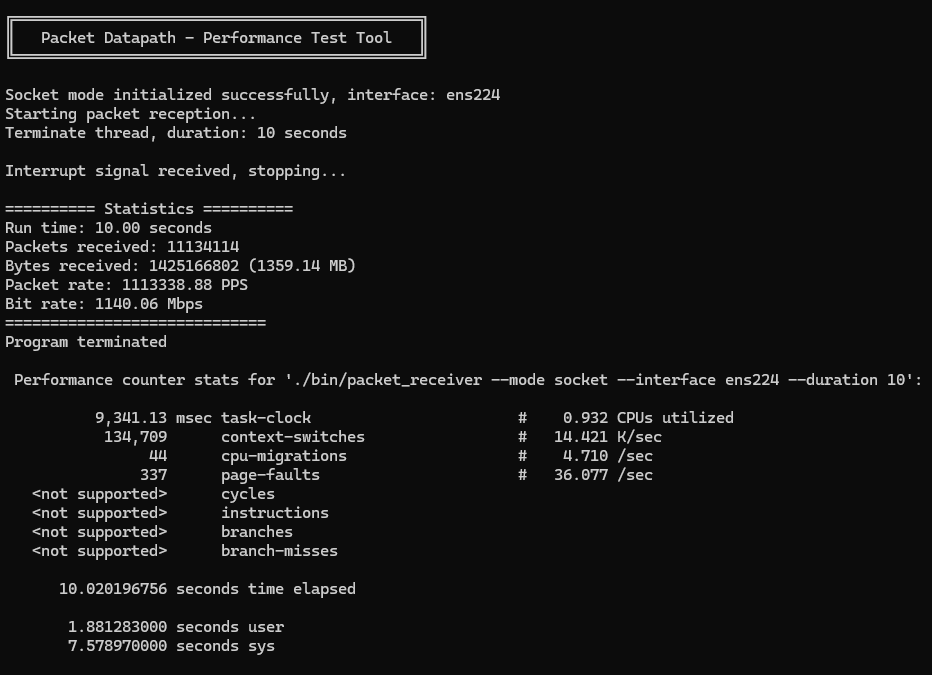
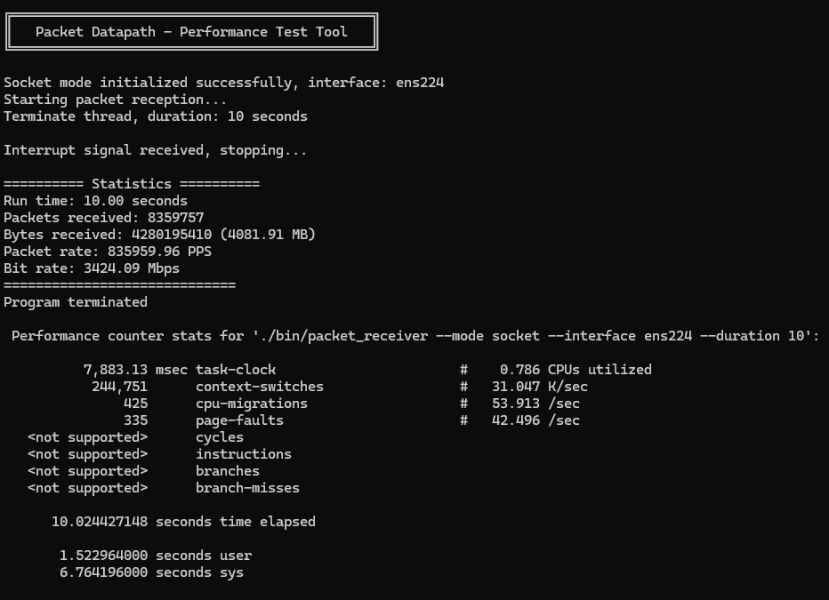
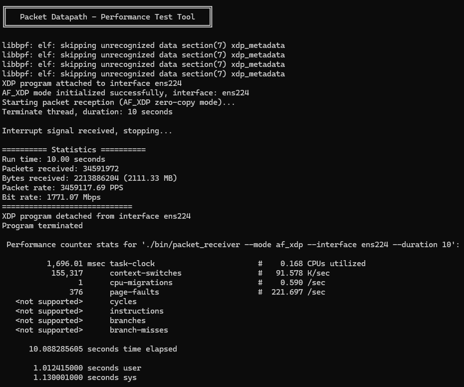
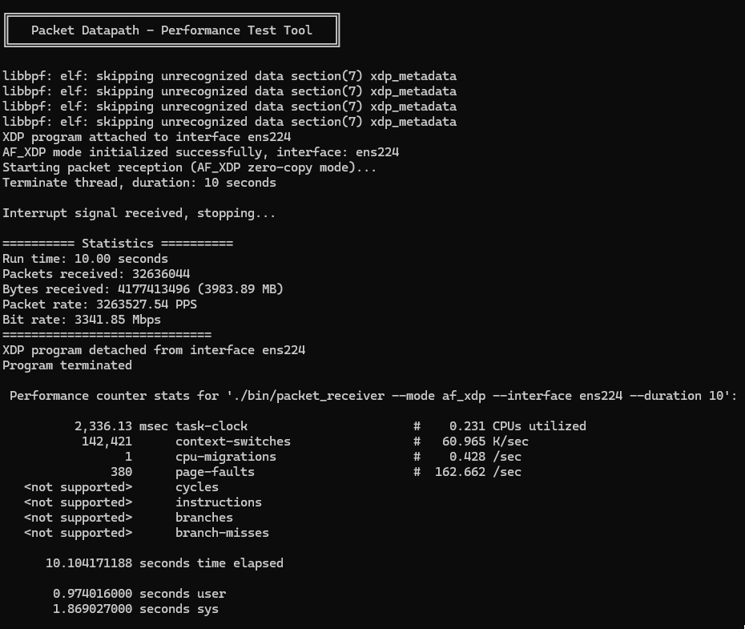
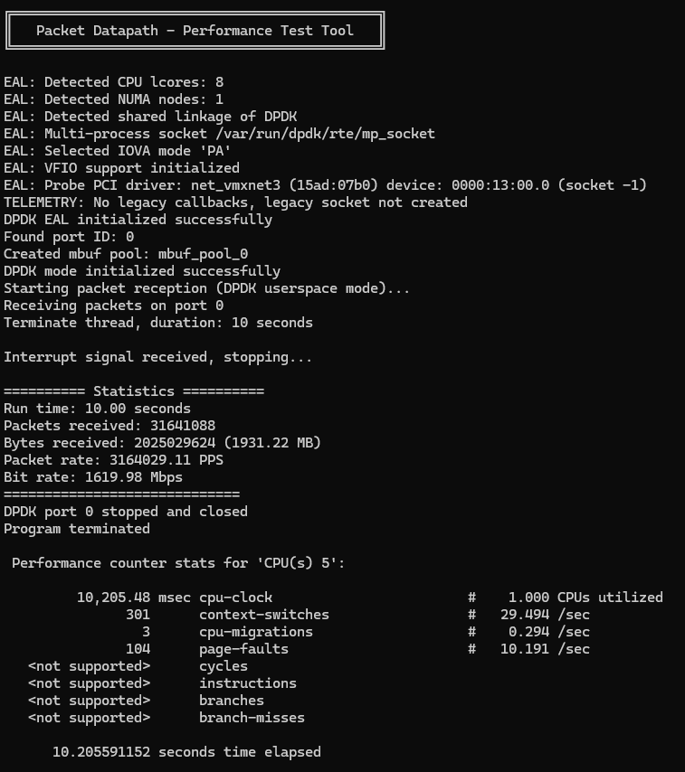
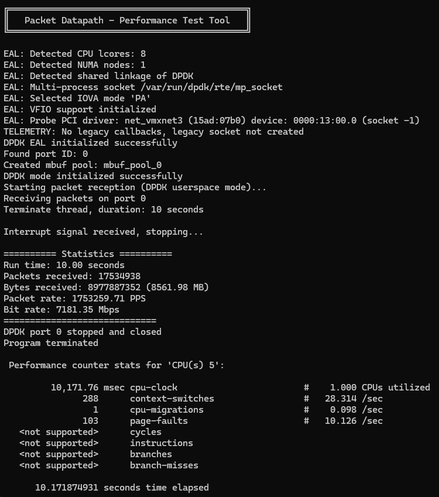

# Test Result

**Control Variable:**
1. Same NIC
2. Run with single core / queue.
3. Each program runs for 10 seconds.

**Independent Variable:**

1. Packet size

## Socket
### 64 Bytes

### 128 Bytes

### 512 Bytes

## AF_XDP (zero copy)
### 64 Bytes

### 128 Bytes

### 512 Bytes

## DPDK
### 64 Bytes

### 128 Bytes

### 512 Bytes

## SUMMARY

### Mode

**PPS**

DPDK > AF_XDP >> SOCKET

**CPU usage**

DPDK > SOCKET >> AF_XDP (polling + blocking)

### Packet size

**Throughput**

512bytes > 128 bytes > 64 bytes

**PPS**

64 bytes > 128 bytes > 512bytes